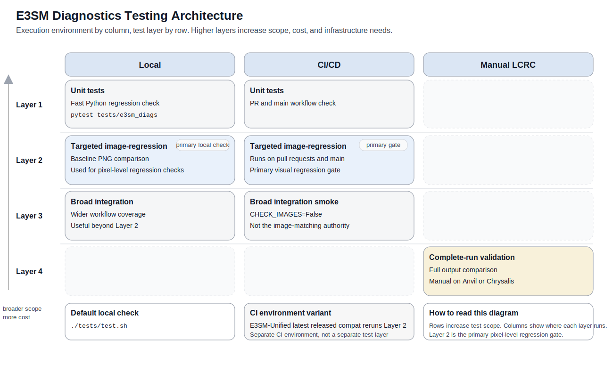

Testing E3SM Diagnostics
========================

Testing at a Glance
-------------------

E3SM Diagnostics uses four test layers across local, CI/CD, and LCRC
environments. The diagram below shows how they fit together.

Recommended Contributor Workflow
--------------------------------

For most changes, use this order:

1. Run Layer 1 unit tests during normal local development.
2. Run Layer 2 targeted image-regression tests locally for changes that may
   affect plots or rendered output.
3. Run the default local check when you want the standard repository checks in
   one command.
4. CI/CD runs Layers 1 to 3 automatically on pull requests and on ``main`` as
   the enforcement backstop.
5. Run Layer 4 manually only when full LCRC validation is needed.

Local Workflows
---------------

Default Local Check
~~~~~~~~~~~~~~~~~~~

To run the repository's default automated local checks in one command:

.. code-block:: bash

   ./tests/test.sh

For Layer 3, ``./tests/test.sh`` first looks for a local downloaded-data tree
at ``/e3sm_diags_downloaded_data``. If it is not present, the helper pulls the
same OCI test-data image used by GitHub Actions and copies
``tests/integration/integration_test_data`` from that image into the working
tree. If you need a nonstandard setup, use ``--source-root`` or ``--image``
with ``tests.integration.download_data`` directly.

Layer 1: Unit Tests
~~~~~~~~~~~~~~~~~~~

**Covers:** unit-level code correctness and API stability.

**When to run:** first during local development.

**Run:**

.. code-block:: bash

   pytest tests/e3sm_diags

Layer 2: Targeted Image-Regression Tests
~~~~~~~~~~~~~~~~~~~~~~~~~~~~~~~~~~~~~~~~

**Covers:** pixel-level regressions from code or dependency changes using
targeted synthetic cases with committed baselines.

**When to run:** after Layer 1, especially for changes that may affect plotting
or rendered output.

**Run:**

.. code-block:: bash

   pytest tests/integration/test_plot_image_regressions.py -m image_regression

**How it works:**

This suite compares generated PNGs against committed baselines in
``tests/integration/baselines/`` and writes dependency metadata for provenance.

It currently covers targeted synthetic regressions for ``lat_lon``, ``polar``,
``zonal_mean_2d``, and ``cosp_histogram``.

**If a test fails:**

Rerun with a persistent artifact directory:

.. code-block:: bash

   IMAGE_REGRESSION_ARTIFACT_DIR=tests/integration/image_check_failures \
   pytest tests/integration/test_plot_image_regressions.py -m image_regression

Inspect ``tests/integration/image_check_failures`` to determine whether the
change is expected. Each failed image artifact directory includes the generated
``runtime_metadata.json`` and a ``dependency_diff.json`` comparing the runtime
environment to the committed ``baseline_metadata.json``.

.. note::

   In GitHub Actions, build artifacts for failed image-regression tests are
   saved and can be downloaded from the bottom of the workflow run summary page.

**How to update baselines:**

If a targeted image change is intentional:

Option 1: Run the manual ``Update Image Baselines`` GitHub Actions workflow.
This refreshes the committed Layer 2 baselines on ``main`` using the same
``conda-env/ci.yml`` and Python 3.13 authority as the main visual-regression
gate. After that workflow finishes successfully, branches still failing only on
targeted image-regression mismatches should rebase onto the updated ``main`` so
they pick up the new committed baselines and rerun CI against them.

Option 2: Refresh baselines locally with terminal commands:

.. code-block:: bash

   conda env create -f conda-env/ci.yml
   conda activate e3sm_diags_ci
   python -m tests.integration.refresh_plot_image_baselines
   pytest tests/integration/test_plot_image_regressions.py -m image_regression

The refresh command regenerates all targeted Layer 2 baselines by default. To
refresh only one targeted case:

.. code-block:: bash

   python -m tests.integration.refresh_plot_image_baselines --case polar

Use the same ``conda-env/ci.yml`` environment and Python 3.13 authority as the
main GitHub Actions visual-regression gate when refreshing committed baselines.
That keeps committed ``baseline_metadata.json`` aligned with the environment
used to validate Layer 2 on ``main``. Commit the updated PNGs and
``baseline_metadata.json``.

Layer 3: Broad Downloaded-Data Integration Tests
~~~~~~~~~~~~~~~~~~~~~~~~~~~~~~~~~~~~~~~~~~~~~~~~

**Covers:** broader workflow smoke coverage using downloaded data to ensure
diagnostic workflows complete and generate outputs, without pixel-level image
matching.

**When to run:** when you want wider integration coverage than Layers 1 and 2,
but do not need exact image comparisons.

**Run:**

.. code-block:: bash

   python -m tests.integration.download_data --data-only
   CHECK_IMAGES=False pytest tests/integration -m 'not image_regression'

**How it works:**

These tests exercise broader diagnostics workflows with downloaded test data.
They run with ``CHECK_IMAGES=False``, so they are intended to catch integration
and workflow regressions rather than serve as the visual regression authority.

By default, ``tests.integration.download_data`` uses the local
``/e3sm_diags_downloaded_data`` tree when it exists. Otherwise it pulls the
same OCI image used by CI and copies the requested test-data directory from
``/e3sm_diags_downloaded_data`` inside that image using ``crane export``. For
nonstandard setups, use the ``--source-root`` or ``--image`` command-line
options.

**Role relative to Layer 2:**

Layer 2 is the primary image-regression gate. Layer 3 provides wider smoke
coverage.

CI/CD Workflows
---------------

Main GitHub Actions Workflow
~~~~~~~~~~~~~~~~~~~~~~~~~~~~

The main GitHub Actions CI/CD workflow runs on pull requests and on ``main``.
It runs:

1. Layer 1 unit tests
2. Layer 2 targeted image-regression tests
3. Layer 3 broad integration smoke tests with ``CHECK_IMAGES=False``

CI/CD is the enforcement backstop. Contributors should still run relevant local
checks before opening a pull request.

Within CI, Layer 2 is the primary visual regression gate. Layer 3 provides
wider smoke coverage, but is not the image-matching authority.

Manual Baseline Refresh Workflow
~~~~~~~~~~~~~~~~~~~~~~~~~~~~~~~~

GitHub Actions also provides a manual ``Update Image Baselines`` workflow.

**Purpose:**

This workflow refreshes the committed Layer 2 baselines directly on ``main``
using the same ``conda-env/ci.yml`` and Python 3.13 environment used by the
main CI visual-regression gate. It exists to avoid opening a baseline-only
pull request when dependency updates legitimately change targeted plots.

**What it runs:**

1. Regenerates all committed Layer 2 baselines with
   ``python -m tests.integration.refresh_plot_image_baselines``
2. Reruns ``pytest tests/integration/test_plot_image_regressions.py -m image_regression``
3. Pushes the result to ``main`` only if the diff is limited to
   ``tests/integration/baselines/``

**When to use it:**

Use this workflow only for intentional baseline refreshes. Normal code changes
should still go through the standard pull request path.

.. note::

   If the workflow fails during verification, it uploads the same image
   regression artifacts used for CI failure triage, including runtime metadata
   and dependency diffs when available.

E3SM-Unified Advisory Compatibility Workflow
~~~~~~~~~~~~~~~~~~~~~~~~~~~~~~~~~~~~~~~~~~~~

GitHub Actions also runs a separate ``E3SM Unified Latest Release Advisory
Compatibility`` job.

**Purpose:**

This job checks ``e3sm_diags`` against the most recent released
``linux-64`` ``nompi`` ``e3sm-unified`` package on conda-forge. It is an
advisory production-compatibility check against the latest published
E3SM-Unified environment, not a preview of unreleased feedstock changes and
not the authoritative Layer 2 visual-regression gate.

**What it runs:**

This workflow runs Layer 2 in an environment derived from the latest released
E3SM-Unified package on conda-forge, which may differ from the main CI
environment if dependencies have changed since the last E3SM-Unified release.
Because it compares current outputs against baselines generated in the main CI
authority environment, dependency-driven rendering drift, such as Matplotlib
version differences, can produce image mismatches even when ``e3sm_diags``
code has not regressed.

.. note::

   Implementation details: this job starts from ``conda-env/ci.yml``, resolves
   the latest released ``e3sm-unified`` package metadata from
   ``conda-forge/linux-64/repodata.json.bz2``, substitutes the released package
   dependency set into the CI environment, caches conda packages with the
   generated environment hash, and then runs Layer 2.

The advisory compatibility workflow uses the same targeted image baselines as
the main Layer 2 suite. Treat failures here as a signal to inspect the
uploaded artifacts for released-environment drift before concluding that a code
change regressed plotting behavior. Baseline refresh decisions remain governed
by the main Layer 2 authority environment on ``main``.

Manual LCRC Validation
----------------------

Layer 4: Complete-Run Validation
~~~~~~~~~~~~~~~~~~~~~~~~~~~~~~~~

**Covers:** full-run validation of all diagnostics against LCRC-hosted expected
results.

**When to run:** when complete-run validation is needed on LCRC-hosted data and
an E3SM-Unified environment on Anvil or Chrysalis.

**Run:**

``tests/integration/complete_run.py`` is separate from CI/CD.

It compares images generated by a full diagnostics run against LCRC-hosted
expected results. This test is manual because it depends on the LCRC data
installation and an E3SM-Unified environment on Anvil or Chrysalis.

.. warning::

   You must run this test manually. It is not part of the CI/CD workflow.

On Anvil or Chrysalis:

.. code-block:: bash

   git fetch <fork-name> <branch-name>
   git checkout -b run-lcrc-test <repo-name>/<branch-name>
   source /lcrc/soft/climate/e3sm-unified/load_latest_e3sm_unified_chrysalis.sh
   # or:
   source /lcrc/soft/climate/e3sm-unified/load_latest_e3sm_unified_anvil.sh
   pip install .
   pytest tests/integration/complete_run.py

**If the test fails:**

Inspect the reported image differences and determine whether the change is
intentional.

Updating Expected Results on LCRC
~~~~~~~~~~~~~~~~~~~~~~~~~~~~~~~~~

If a complete-run image change is intentional:

.. code-block:: bash

   cd /lcrc/group/e3sm/public_html/e3sm_diags_test_data/unit_test_complete_run/expected
   cat README.md
   mv all_sets previous_output/all_sets_<version>_<date>_<hash>
   mv image_list_all_sets.txt previous_output/image_list_all_sets_<version>_<date>_<hash>.txt
   mv <version>_all_sets/ /lcrc/group/e3sm/public_html/e3sm_diags_test_data/unit_test_complete_run/expected/all_sets
   cd /lcrc/group/e3sm/public_html/e3sm_diags_test_data/unit_test_complete_run/expected/all_sets
   find . -type f -name '*.png' > ../image_list_all_sets.txt
   cd ..

After the pull request is merged, update the LCRC ``README.md`` metadata to
match the E3SM Diags version, date, and git commit used to generate the new
expected images.