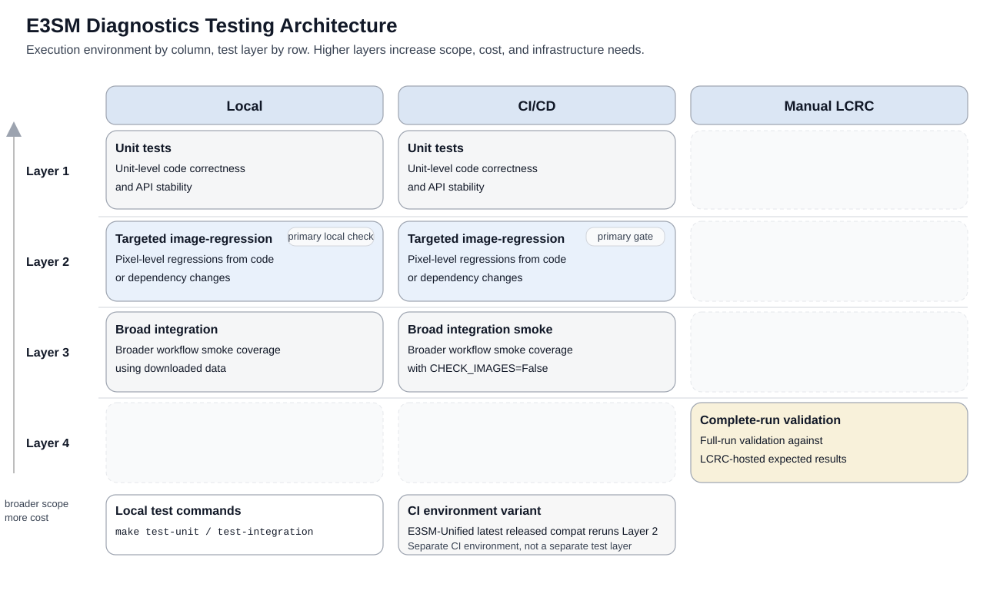

Testing E3SM Diagnostics
========================

Testing Architecture
--------------------

E3SM Diagnostics uses four test layers across local, CI/CD, and LCRC
environments:

1. Unit tests for code correctness
2. Targeted image-regression tests for rendered output
3. Broad integration tests for diagnostic workflows
4. Complete-run validation against HPC-hosted data

Recommended Contributor Workflow
--------------------------------

For most changes:

1. Run Layer 1 during local development.
2. Run Layer 2 for changes that may affect plots or rendered output.
3. Run Layer 3 when broader workflow coverage is needed.
4. Run the repository's default local checks before opening a pull request.
5. Let CI/CD enforce Layers 1 through 3 on the pull request.
6. Run Layer 4 manually for high-risk changes requiring full NERSC validation.

Local Test Layers
-----------------

Before running a test or baseline-promotion command, activate the E3SM Diags
Conda environment:

.. code-block:: bash

   conda activate <e3sm_diags_env>

Layer 1: Unit Tests
~~~~~~~~~~~~~~~~~~~

Unit tests check code correctness and API stability. Run them first during
local development:

.. code-block:: bash

   make test-unit

Layer 2: Targeted Image-Regression Tests
~~~~~~~~~~~~~~~~~~~~~~~~~~~~~~~~~~~~~~~~

These tests detect pixel-level plot regressions using targeted synthetic cases
and committed PNG baselines. Run them after Layer 1 when a code or dependency
change may affect rendered output:

.. code-block:: bash

   make test-image-regression

The suite currently covers:

- ``lat_lon``
- ``polar``
- ``zonal_mean_2d``
- ``cosp_histogram``

Baselines and their dependency metadata are stored in
``tests/integration/baselines/``.

Investigating Failures
^^^^^^^^^^^^^^^^^^^^^^

Rerun the test with a persistent artifact directory:

.. code-block:: bash

   IMAGE_REGRESSION_ARTIFACT_DIR=tests/integration/image_check_failures \
       make test-image-regression

Inspect ``tests/integration/image_check_failures`` to determine whether the
change is expected. Each failed case includes:

- The generated image
- ``runtime_metadata.json``
- ``dependency_diff.json``, comparing the runtime environment with the
  committed ``baseline_metadata.json``

.. note::

   GitHub Actions uploads these artifacts when an image-regression test fails.
   Download them from the workflow run summary page.

Updating Baselines
^^^^^^^^^^^^^^^^^^

Update baselines only when the plot change is intentional.

The preferred method is the manual ``Update Image Baselines`` GitHub Actions
workflow. It regenerates baselines on ``main`` using the authoritative
``conda-env/ci.yml`` and Python 3.14 environment.

After the workflow completes, rebase affected branches onto ``main`` and rerun
CI.

To refresh baselines locally:

.. code-block:: bash

   conda env create -f conda-env/ci.yml
   conda activate e3sm_diags_ci
   python -m tests.integration.refresh_plot_image_baselines
   make test-image-regression

To refresh one case:

.. code-block:: bash

   python -m tests.integration.refresh_plot_image_baselines --case polar

Use the same ``conda-env/ci.yml`` and Python 3.14 environment as the main CI
visual-regression gate. Commit the updated PNGs and
``baseline_metadata.json``.

Layer 3: Broad Downloaded-Data Integration Tests
~~~~~~~~~~~~~~~~~~~~~~~~~~~~~~~~~~~~~~~~~~~~~~~~

These tests exercise broader diagnostic workflows with downloaded data. They
verify that workflows complete and generate outputs, but do not perform
pixel-level image comparisons.

Run them when broader integration coverage is needed:

.. code-block:: bash

   make test-integration

The integration target downloads its required data automatically. It runs with
``CHECK_IMAGES=False``, making Layer 3 a workflow smoke test rather than the
visual-regression authority.

By default, ``tests.integration.download_data`` uses the local
``/e3sm_diags_downloaded_data`` directory when available. Otherwise, it uses
``crane export`` to copy that directory from the OCI image used by CI.

Use ``--source-root`` or ``--image`` for nonstandard data sources.

Layer 4: Complete-Run Validation
~~~~~~~~~~~~~~~~~~~~~~~~~~~~~~~~

Layer 4 runs a large cross-section of diagnostics against HPC-hosted data and
compares the resulting netCDF files and PNG plots with an accepted baseline.
It is a manual workflow intended for high-risk changes and release validation.

See `Complete-Run Validation`_ for instructions.

Complete-Run Validation
-----------------------

Choosing an Environment
~~~~~~~~~~~~~~~~~~~~~~~

A comparison cannot attribute a numerical difference to code or to
dependencies, so decide which of the two is held fixed before running.

Build the environment on a login node, before requesting an allocation. The
solve is network-bound with no compute, so doing it inside an allocation wastes
node hours:

.. code-block:: bash

   STAMP=$(date -u +%Y%m%d)-$(git rev-parse --short HEAD)
   ENV_PREFIX=$SCRATCH/e3sm_diags_complete_run_$STAMP

**Code validation.** Reproduce the baseline's environment, so any difference is
attributable to the code under review. This is the default for validating a
branch. Every result directory keeps a full ``conda env export`` at
``prov/environment.yml``, so the baseline's environment is reconstructible:

.. code-block:: bash

   mamba env create -f <baseline-dir>/prov/environment.yml -p "$ENV_PREFIX"

**Environment regression.** Solve a fresh environment from ``conda-env/dev.yml``
and run from a clean ``main`` checkout, so the code matches the baseline and any
difference is attributable to dependencies. ``dev.yml`` carries floating
constraints that only a fresh solve exercises, which makes this the pre-release
gate rather than a per-PR step:

.. code-block:: bash

   mamba env create -f conda-env/dev.yml -p "$ENV_PREFIX"

Either way, install the package itself afterward. ``dev.yml`` and the exported
``environment.yml`` both install dependencies only:

.. code-block:: bash

   conda activate "$ENV_PREFIX"
   pip install .

Placing the prefix in ``$SCRATCH`` is intended. ``$SCRATCH`` is purged on
NERSC's schedule, and the durable record of the environment is
``prov/environment.yml`` and the manifest inside the immutable results
directory on CFS.

Running Complete Validation
~~~~~~~~~~~~~~~~~~~~~~~~~~~

Run Layer 4 on a NERSC compute node. Submitting a batch job avoids holding an
interactive session open for the length of the run:

.. code-block:: bash

   cat > "$SCRATCH/complete_run_$STAMP.sbatch" <<EOF
   #!/bin/bash
   #SBATCH --account=e3sm
   #SBATCH --qos=regular
   #SBATCH --constraint=cpu
   #SBATCH --nodes=1
   #SBATCH --time=01:00:00
   #SBATCH --output=$SCRATCH/complete_run_$STAMP.log

   set -eo pipefail
   source \$(conda info --base)/etc/profile.d/conda.sh
   conda activate $ENV_PREFIX
   cd $(pwd)
   make test-complete-validate
   EOF

   sbatch "$SCRATCH/complete_run_$STAMP.sbatch"

A batch shell is not a login shell, so ``conda activate`` requires sourcing
``conda.sh`` first. The ``cd`` into the repository is also required:
``tests.complete_run.run`` resolves both the ``tests`` package and
``e3sm_diags`` from the current directory, so running from elsewhere silently
tests the installed ``e3sm_diags`` instead of the working tree. Request a whole
node rather than ``--qos shared``; the diagnostics default to 24 workers and
``enso_diags`` has a history of per-worker memory spikes.

An interactive allocation works equally well for a run being watched:

.. code-block:: bash

   salloc --nodes 1 --qos interactive --time 04:00:00 --constraint cpu --account=e3sm
   conda activate "$ENV_PREFIX"
   make test-complete-validate

By default, results are saved beneath:

.. code-block:: text

   /global/cfs/cdirs/e3sm/www/e3sm_diags/complete-run-test/

Each run receives an immutable timestamped directory containing the branch and
commit suffix. The workflow runs the diagnostics, compares the results with the
accepted ``latest-main`` baseline, and writes a JSON report and PNG diff
artifacts.

The comparison report's ``environment`` section records the curated package and
platform differences between the run and its baseline. Read it before the
per-category results: in an environment-regression run it is the result, and in
a code-validation run it should be empty, since a non-empty section means the
environment did not reproduce the baseline's and the numerical differences are
not attributable to code.

Repeating the Comparison
~~~~~~~~~~~~~~~~~~~~~~~~

The diagnostic run is expensive, but the comparison can be repeated without
rerunning diagnostics. A comparison failure leaves the candidate results and
artifacts in place for review.

Repeat the comparison with the default ``latest-main`` baseline:

.. code-block:: bash

   make test-complete-compare RUN_DIR=<results-dir>

To use a specific baseline, set ``BASELINE_DIR``:

.. code-block:: bash

   make test-complete-compare \
     RUN_DIR=<results-dir> \
     BASELINE_DIR=<baseline-dir>

Comparison reports and PNG artifacts are written beneath the ``comparison/``
directory beside the complete-run result directories.

``--write-diff-html`` writes an ``index.html`` beside the report listing every
image mismatch, sorted by mismatch fraction and filterable by set, with each
plot beside its baseline and diff. It implies ``--write-diff-pngs``.

netCDF values are compared with a relative tolerance of ``1e-5`` and an
absolute tolerance of ``0.0``; absolute tolerance is deliberately unused
because it is oversensitive on difference fields. Override either with
``--rtol`` and ``--atol`` on ``tests.complete_run.compare``. Loosening a
tolerance is a review aid rather than a way to reach a passing comparison, so
report any comparison that passed only at a widened tolerance as such.

Promoting an Approved Baseline
~~~~~~~~~~~~~~~~~~~~~~~~~~~~~~

If the changes are approved, merge the branch and run the complete workflow
from a ``main`` checkout:

.. code-block:: bash

   make test-complete
   make test-complete-compare RUN_DIR=<main-results-dir>

Then promote the new ``main`` result:

.. code-block:: bash

   make promote-complete RUN_DIR=<main-results-dir>

Running Only the Visual Comparison
~~~~~~~~~~~~~~~~~~~~~~~~~~~~~~~~~~

The PNG comparison uses the same pixel mismatch threshold as the targeted
image-regression suite (``0.0002`` by default). Run only the visual comparison
with:

.. code-block:: bash

   python -m tests.complete_run.compare \
     --dev-dir <results-dir> \
     --mode images

Use ``--image-mismatch-threshold`` only when a reviewed environment difference
requires a different tolerance.

CI/CD Workflows
---------------

Main CI/CD Workflow
~~~~~~~~~~~~~~~~~~~

The main GitHub Actions workflow runs on pull requests and ``main``. It
includes:

1. Layer 1 unit tests
2. Layer 2 targeted image-regression tests
3. Layer 3 integration smoke tests with ``CHECK_IMAGES=False``

Layer 2 is the authoritative visual-regression gate. Layer 3 provides broader
workflow coverage without image matching.

Manual Image-Baseline Refresh
~~~~~~~~~~~~~~~~~~~~~~~~~~~~~

The manual ``Update Image Baselines`` workflow updates committed Layer 2
baselines directly on ``main``. It is intended for legitimate plot changes
caused by dependency updates or other approved changes, avoiding a
baseline-only pull request.

The workflow:

1. Regenerates all Layer 2 baselines.
2. Reruns the targeted image-regression suite.
3. Pushes to ``main`` only when the diff is limited to
   ``tests/integration/baselines/``.

Use this workflow only for intentional baseline updates. Normal code changes
must use the standard pull request workflow.

.. note::

   If verification fails, the workflow uploads the generated images, runtime
   metadata, and dependency differences for review.

E3SM-Unified Advisory Compatibility
~~~~~~~~~~~~~~~~~~~~~~~~~~~~~~~~~~~

The manual ``E3SM Unified Latest Release Advisory Compatibility`` workflow
runs Layer 2 against the latest released Linux ``nompi`` ``e3sm-unified``
package from conda-forge.

This is an advisory production-compatibility check, not the authoritative
visual-regression gate. It compares plots from the released E3SM-Unified
environment with baselines generated by the main CI environment. Dependency
differences, such as different Matplotlib versions, may therefore cause image
mismatches without indicating an ``e3sm_diags`` regression.

Run this workflow when evaluating compatibility with the released
E3SM-Unified environment. Review uploaded artifacts before classifying a
failure as a code regression.

Implementation Details
^^^^^^^^^^^^^^^^^^^^^^

The workflow:

1. Starts from ``conda-env/ci.yml``.
2. Resolves the latest released ``e3sm-unified`` package metadata from
   ``conda-forge/linux-64/repodata.json.bz2``.
3. Substitutes the released package dependencies into the CI environment.
4. Caches Conda packages using the generated environment hash.
5. Runs the Layer 2 image-regression suite.

Baseline updates remain governed by the main Layer 2 environment on ``main``.
