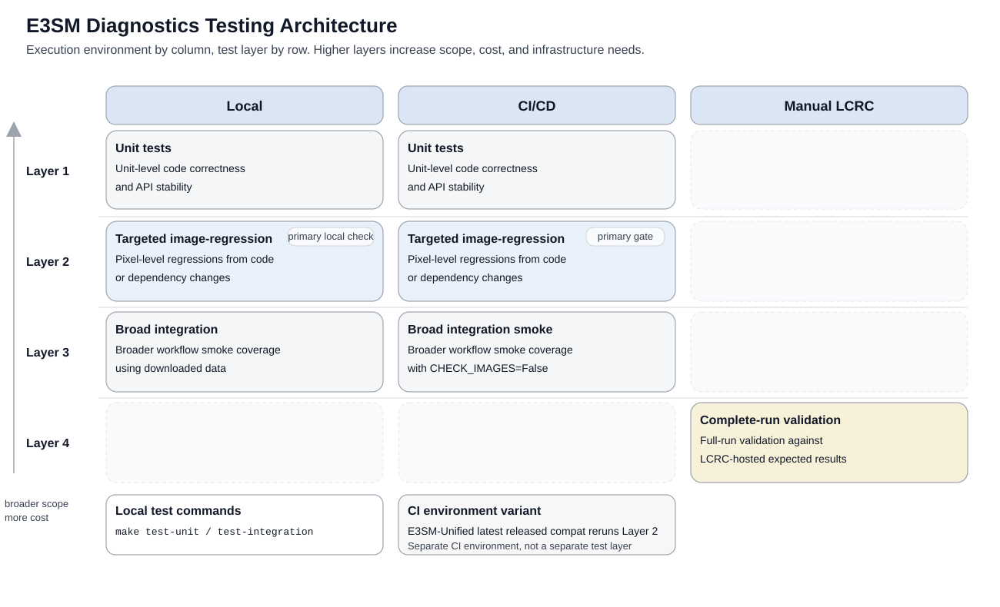

Testing E3SM Diagnostics
========================

Testing Architecture
--------------------

E3SM Diagnostics uses four test layers across local, CI/CD, and LCRC
environments:

1. Unit tests for code correctness
2. Targeted image-regression tests for rendered output
3. Broad integration tests for diagnostic workflows
4. Complete-run validation against HPC-hosted data

Recommended Contributor Workflow
--------------------------------

For most changes:

1. Run Layer 1 during local development.
2. Run Layer 2 for changes that may affect plots or rendered output.
3. Run Layer 3 when broader workflow coverage is needed.
4. Run the repository's default local checks before opening a pull request.
5. Let CI/CD enforce Layers 1 through 3 on the pull request.
6. Run Layer 4 manually for high-risk changes requiring full NERSC validation.

Local Test Layers
-----------------

Before running a test or baseline-promotion command, activate the E3SM Diags
Conda environment:

.. code-block:: bash

   conda activate <e3sm_diags_env>

Layer 1: Unit Tests
~~~~~~~~~~~~~~~~~~~

Unit tests check code correctness and API stability. Run them first during
local development:

.. code-block:: bash

   make test-unit

Layer 2: Targeted Image-Regression Tests
~~~~~~~~~~~~~~~~~~~~~~~~~~~~~~~~~~~~~~~~

These tests detect pixel-level plot regressions using targeted synthetic cases
and committed PNG baselines. Run them after Layer 1 when a code or dependency
change may affect rendered output:

.. code-block:: bash

   make test-image-regression

The suite currently covers:

- ``lat_lon``
- ``polar``
- ``zonal_mean_2d``
- ``cosp_histogram``

Baselines and their dependency metadata are stored in
``tests/integration/baselines/``.

Investigating Failures
^^^^^^^^^^^^^^^^^^^^^^

Rerun the test with a persistent artifact directory:

.. code-block:: bash

   IMAGE_REGRESSION_ARTIFACT_DIR=tests/integration/image_check_failures \
       make test-image-regression

Inspect ``tests/integration/image_check_failures`` to determine whether the
change is expected. Each failed case includes:

- The generated image
- ``runtime_metadata.json``
- ``dependency_diff.json``, comparing the runtime environment with the
  committed ``baseline_metadata.json``

.. note::

   GitHub Actions uploads these artifacts when an image-regression test fails.
   Download them from the workflow run summary page.

Updating Baselines
^^^^^^^^^^^^^^^^^^

Update baselines only when the plot change is intentional.

The preferred method is the manual ``Update Image Baselines`` GitHub Actions
workflow. It regenerates baselines on ``main`` using the authoritative
``conda-env/ci.yml`` and Python 3.14 environment.

After the workflow completes, rebase affected branches onto ``main`` and rerun
CI.

To refresh baselines locally:

.. code-block:: bash

   conda env create -f conda-env/ci.yml
   conda activate e3sm_diags_ci
   make refresh-image-regression
   make test-image-regression

To refresh one case:

.. code-block:: bash

   python -m tests.integration.refresh_plot_image_baselines --case polar

Use the same ``conda-env/ci.yml`` and Python 3.14 environment as the main CI
visual-regression gate. Commit the updated PNGs and
``baseline_metadata.json``.

Layer 3: Broad Downloaded-Data Integration Tests
~~~~~~~~~~~~~~~~~~~~~~~~~~~~~~~~~~~~~~~~~~~~~~~~

These tests exercise broader diagnostic workflows with downloaded data. They
verify that workflows complete and generate outputs, but do not perform
pixel-level image comparisons.

Run them when broader integration coverage is needed:

.. code-block:: bash

   make test-integration

The integration target downloads its required data automatically. It runs with
``CHECK_IMAGES=False``, making Layer 3 a workflow smoke test rather than the
visual-regression authority.

By default, ``tests.integration.download_data`` uses the local
``/e3sm_diags_downloaded_data`` directory when available. Otherwise, it uses
``crane export`` to copy that directory from the OCI image used by CI.

Use ``--source-root`` or ``--image`` for nonstandard data sources.

Layer 4: Complete-Run Validation
~~~~~~~~~~~~~~~~~~~~~~~~~~~~~~~~

Layer 4 runs a broad set of diagnostics against HPC-hosted data and compares
NetCDF outputs and PNG plots with an accepted baseline. Use it for high-risk
changes, release validation, and scheduled regression checks.

See `Complete-Run Validation`_ for instructions.

Complete-Run Validation
-----------------------

Choose the workflow that matches what you need to test:

.. list-table::
   :header-rows: 1
   :widths: 30 70

   * - Workflow
     - Purpose
   * - `Automated Validation at NERSC`_
     - Test an exact ``origin/main`` revision with fresh dependencies.
   * - `Manual Validation`_
     - Test the working checkout, including unmerged changes, or isolate
       dependency changes by holding the code revision fixed.

Both workflows preserve results for `Review Results and Manage Baselines`_.

Automated Validation at NERSC
~~~~~~~~~~~~~~~~~~~~~~~~~~~~~

Two scheduled controllers separate job submission from reporting:

.. list-table::
   :header-rows: 1
   :widths: 20 30 50

   * - Controller
     - Schedule (Pacific time)
     - Responsibility
   * - Submission
     - Sunday at 06:00 on even ISO weeks
     - Resolve ``origin/main``, create a detached worktree, submit a CPU
       Slurm job, record ``submitted`` status, and exit.
   * - Reporting
     - Monday at 09:00 every week
     - Check jobs, generate reports, and publish comparison and operational
       failures to GitHub Discussions.

The CPU job creates a fresh, timestamped, SHA-qualified environment from
that revision's ``ci.yml`` and runs diagnostics and comparisons. The cron
controllers do not create diagnostics environments or wait for CPU resources.

The reporting controller skips queued and running jobs until they exceed the
configured stall threshold (72 hours by default), at which point it reports
and notifies administrators. If Slurm accounting is not yet available after a
job leaves the queue, it retries on its next invocation. Publication receipts
prevent duplicate posts. Terminal operational failures and comparison failures
also notify the administrator team.

The submission schedule is normally biweekly, with a three-week gap across
ISO years that contain 53 weeks.

NERSC evaluates ``scrontab`` expressions in UTC. The installed table contains
both UTC offsets around each Pacific-time target, and the wrappers use
``America/Los_Angeles`` to admit exactly the 06:00 submission or 09:00
reporting invocation across daylight-saving transitions.

Submit a Single Automated Run
^^^^^^^^^^^^^^^^^^^^^^^^^^^^^

To submit a run without waiting for the schedule:

.. code-block:: bash

   python -m tests.complete_run.automation \
       --worktree-root "$PSCRATCH/e3sm_diags-worktrees" \
       --environment-root "$PSCRATCH/e3sm_diags-environments" \
       --account e3sm

This submits the diagnostics job; reporting is handled separately by the
reporting controller.

Configure and Maintain Automation
~~~~~~~~~~~~~~~~~~~~~~~~~~~~~~~~~

Scheduled runs use the controller wrapper and
``tests/complete_run/complete-run.scrontab.template``.

The compute allocation needs access to the configured Conda channels and
package index, or the required packages must already be available locally.
The operations owner configures job resources, CFS-to-Portal mapping,
retention, and notifications.

Operations Directory
^^^^^^^^^^^^^^^^^^^^

On NERSC Perlmutter, ``mache`` machine detection (``pm-cpu`` or ``pm-gpu``)
selects the following non-public CFS operations directory automatically:

.. code-block:: text

   /global/cfs/projectdirs/e3sm/e3sm_diags/operations/
   ├── e3sm_diags/       # Controller checkout
   ├── controller.env   # Private configuration
   ├── controller-env/  # Persistent controller Conda environment
   └── logs/            # Cron logs

The complete-run results root is also selected automatically:
``/global/cfs/cdirs/e3sm/www/e3sm_diags/complete-run-test``.
You do not need to set ``CONFIG``, ``OPERATIONS_DIR``, or a results path for
the standard NERSC deployment. Detection selects paths only; it does not create
the deployment, configure credentials, or enable scheduling. Existing controller
configuration, including ``RESULTS_ROOT``, remains authoritative.

For a custom deployment, use ``make ops-init OPERATIONS_DIR=/absolute/path/operations``
and pass ``CONFIG=/absolute/path/operations/controller.env`` to subsequent
operations commands (or set ``E3SM_DIAGS_OPS_CONFIG``). Manual complete runs
can override the output location with ``--results-dir``. On unmapped machines
or when detection is unavailable, operations require an explicit configuration
or an existing checkout-parent configuration, and initialization requires
``OPERATIONS_DIR``. Manual results defaults retain the historical NERSC root;
use ``--results-dir`` if that location is unavailable.

Use ``$PSCRATCH`` for detached worktrees and diagnostics environments. Keep
candidate results outside the controller checkout and retain them on CFS.
Each immutable automated run is stored under:

.. code-block:: text

   <RESULTS_ROOT>/automation/<sha>-<timestamp>/

This directory includes the run's ``results/``, comparison artifacts, Slurm
output, status, and reports.

Set Up Scheduled Runs
^^^^^^^^^^^^^^^^^^^^^

1. **Initialize the operations directory.**

   From an existing checkout:

   .. code-block:: bash

      make ops-init

   This creates the controller checkout, external configuration, and logs
   directory. It defaults to ``main``, clones only if the checkout is
   absent, and never overwrites an existing configuration. To test
   unmerged automation changes, add ``BRANCH=<branch>``.

2. **Create the reporting token.**

   A repository administrator must enable Discussions in
   ``E3SM-Project/e3sm_diags`` and create the
   ``Complete Test Run Reports`` category.

   Use a dedicated machine account with organization membership and write
   access to the repository. While signed in as that account, create a
   `fine-grained personal access token
   <https://github.com/settings/personal-access-tokens/new>`_ with:

   * Resource owner: ``E3SM-Project``.
   * Repository access: only ``e3sm_diags``.
   * Repository permission: **Discussions: read and write**.
   * Expiration: a duration permitted by organization policy, with renewal
     arranged before expiration.

   Store the token under the account that runs the controller:

   .. code-block:: bash

      make ops-token-create TOKEN_FILE="$HOME/.config/e3sm_diags/e3sm_diags-token"

   This interactively creates the specified file with mode ``0600`` and refuses
   to overwrite an existing token. Without ``TOKEN_FILE``, it uses the configured
   ``E3SM_DIAGS_TOKEN_FILE``. For another location, use ``TOKEN_FILE=/absolute/path/to/token``.
   Keep the token outside the repository; store only its path in
   ``controller.env``.

3. **Configure the controller.**

   .. code-block:: bash

      $EDITOR /global/cfs/projectdirs/e3sm/e3sm_diags/operations/controller.env

   Review these settings and the values for CFS-to-Portal mapping,
   retention, and notifications:

   .. list-table::
      :header-rows: 1
      :widths: 40 60

      * - Setting
        - Purpose or template default
      * - ``CONDA_BASE``
        - Base Conda installation, such as
          ``/global/homes/v/<user>/miniforge3``.
      * - ``CONTROLLER_ENV_PREFIX``
        - Automatically filled in for the selected operations directory;
          change only for a custom controller environment location.
      * - ``E3SM_DIAGS_TOKEN_FILE``
        - Token-file path, typically
          ``$HOME/.config/e3sm_diags/e3sm_diags-token``.
      * - ``SLURM_ACCOUNT``, ``SLURM_QOS``, ``SLURM_NODES``,
          ``SLURM_WALLTIME``, ``SLURM_CONSTRAINT``
        - Diagnostics-job resources: ``e3sm``, ``regular``, ``1``,
          ``02:00:00``, and ``cpu``, respectively.
      * - ``SCRON_CPUS``, ``SCRON_MEMORY_PER_CPU``
        - Controller resources: two CPUs and ``2G`` per CPU, totaling ``4G``.
          These are separate from diagnostics-job resources.
      * - ``E3SM_DIAGS_STALL_THRESHOLD_HOURS``
        - Age after which a queued or running run is reported as stalled;
          defaults to ``72``.

   Keep ``controller.env`` outside the repository with mode ``0600``.
   ``ops-init`` fills in deployment paths and the machine-default results root but
   does not enable scheduling. Use single quotes for values containing spaces;
   use literal paths, not shell expansions. ``LOG_DIR`` must not contain whitespace
   or shell metacharacters because Slurm resource directives are not shell commands.

4. **Create the controller environment and install the schedule.**

   Run each command only after the previous command succeeds:

   .. code-block:: bash

      make ops-env ACTION=create
      make ops-enable CONFIRM=YES

   Installation preserves unrelated user schedules: it replaces only the
   explicitly marked E3SM Diags managed block in the existing scrontab.
   Enablement first validates configuration, executable scripts, and the
   persistent controller environment.

Maintain Scheduled Runs
^^^^^^^^^^^^^^^^^^^^^^^

Run maintenance commands from any E3SM Diagnostics checkout with this operator
interface. Machine detection locates the standard NERSC deployment, so changing
to the controller checkout or setting path variables is unnecessary.

.. list-table::
   :header-rows: 1
   :widths: 25 75

   * - Task
     - Command
   * - Inspect deployment, environment presence, schedule, jobs, latest run and publication
     - ``make ops``
   * - Inspect recent controller and reporter logs
     - ``make ops-logs [JOB=<id>] [LINES=100]``
   * - Fast-forward checkout and validate (without updating Conda)
     - ``make ops-update``
   * - Submit a catch-up run, bypassing only cron time/week guards
     - ``make ops-run CONFIRM=YES``
   * - Process eligible completed runs and retry publication, separately from submission
     - ``make ops-report CONFIRM=YES``
   * - Show everyday commands first, administration commands second
     - ``make ops-help``
   * - Update controller environment
     - ``make ops-env ACTION=update CONFIRM=YES``
   * - Remove schedule
     - ``make ops-disable CONFIRM=YES``

Configuration is resolved in this order: explicit ``CONFIG=/path/controller.env``,
``E3SM_DIAGS_OPS_CONFIG``, then an existing ``controller.env`` in the current
checkout's parent directory, then ``controller.env`` in the machine-default
operations directory. A missing explicitly selected configuration is an error;
it never silently switches deployments. Missing configuration produces setup
guidance naming the selected path, not a filesystem search. The dashboard
prominently displays configuration and deployment paths;
recurring jobs' next eligible occurrences are not previous run outcomes.

``make ops`` is a read-only, sectioned dashboard: deployment paths and health,
installed managed cron entries, Slurm cron jobs and eligible times, latest
recorded run outcome, and report/publication status. Known controller/reporter
job names are shortened and columns are separated without truncation. Installed
cron expressions are shown in UTC; eligible times use Slurm's display timezone.
``N/A`` is an unavailable eligible time, not a failed run. Missing tools, invalid
configuration, and malformed metadata remain visible. Optional publication
markers are shown only when present; their absence does not imply a publication
failure. For the full installed schedule and resource directives, use
``scrontab -l``; full run metadata is in the displayed metadata directory.

For an optional Bash shortcut usable from any directory, run ``make ops-shortcut``
and copy the printed function into your shell (or your startup file yourself).
It quotes configured paths and forwards arguments, supporting ``e3sm-ops``,
``e3sm-ops logs``, ``e3sm-ops update``, ``e3sm-ops run CONFIRM=YES``, and
``e3sm-ops report CONFIRM=YES``. No startup files are edited automatically.

``ops-update`` rejects dirty, detached, ahead/diverged checkouts and unfinished
Git operations, uses fast-forward-only updates, and validates the deployment
under the shared controller-environment lock. Environment creation and updating
remain explicit actions; neither setup nor checkout updates change Conda.
Manual run/report actions retain environment activation, allocation settings,
shared/component locks, immutable run records, and publication retry safeguards.
They run the short controller/reporter on the login node with the persistent
controller environment; diagnostics still execute in the submitted allocation.
Busy locks return a nonzero exit status for manual actions. Repeated confirmed
``ops-run`` commands can submit multiple catch-up runs: there is no once-per-period
guard beyond the cron time/week checks, which manual execution bypasses.
If post-update validation fails, the checkout remains updated and the command
reports its previous revision. Disable scheduling with ``ops-disable CONFIRM=YES``
before repairing the environment or manually recovering the prior checkout.
Disabling scheduling requires no configuration file and does not cancel jobs.
Successful runs do not necessarily publish Discussions: only qualifying failure
reports are published.

Update the controller environment manually after controller code or
dependency changes, never from ``scrontab``. The update holds the shared
controller-environment lock (also held by submission and reporting), exports
the current environment to ``operations/provenance/``, updates from the
checkout's ``ci.yml``, reinstalls the checkout, and verifies the CLI. Removing
the schedule likewise removes only the managed E3SM Diags block and preserves
unrelated entries, existing results, and submitted jobs.

The operations owner manages result and environment retention and retries
failed publication using preserved Markdown reports. Temporary environments
are subject to the ``$PSCRATCH`` purge policy.

Manual Validation
~~~~~~~~~~~~~~~~~

Use this workflow to test the working checkout or control which code and
dependencies change.

1. **Prepare the environment on a NERSC login node.**

   .. code-block:: bash

      STAMP=$(date -u +%Y%m%d)-$(git rev-parse --short HEAD)
      ENV_PREFIX="$PSCRATCH/e3sm_diags_complete_run_$STAMP"

   Choose the dependency source:

   .. list-table::
      :header-rows: 1
      :widths: 25 35 40

      * - Goal
        - Environment file
        - Code revision
      * - Validate code changes
        - ``<baseline-dir>/prov/environment.yml``
        - Working checkout with the changes to test.
      * - Isolate dependency changes
        - ``conda-env/dev.yml``
        - Baseline's exact revision. Using newer code also tests code changes.

   Create the selected environment, then install the checkout:

   .. code-block:: bash

      mamba env create -f <environment-file> -p "$ENV_PREFIX"
      conda activate "$ENV_PREFIX"
      pip install .

2. **Submit validation from the repository root.**

   Adjust the account, QoS, and walltime for your allocation. Request a full
   CPU node: diagnostics default to 24 workers, and ``enso_diags`` can have
   memory spikes.

   .. code-block:: bash

      cat > "$PSCRATCH/complete_run_$STAMP.sbatch" <<EOF
      #!/bin/bash
      #SBATCH --account=e3sm
      #SBATCH --qos=regular
      #SBATCH --constraint=cpu
      #SBATCH --nodes=1
      #SBATCH --time=01:00:00
      #SBATCH --output=$PSCRATCH/complete_run_$STAMP.log
      set -eo pipefail
      source "$(conda info --base)/etc/profile.d/conda.sh"
      conda activate "$ENV_PREFIX"
      cd "$(pwd)"
      make test-complete-validate
      EOF
      sbatch "$PSCRATCH/complete_run_$STAMP.sbatch"

   Alternatively, request an interactive allocation and run validation
   from the repository root:

   .. code-block:: bash

      salloc --nodes 1 --qos interactive --time 04:00:00 --constraint cpu --account=e3sm
      conda activate "$ENV_PREFIX"
      make test-complete-validate

3. **Locate and review the results.**

   Each run creates an immutable timestamped directory with a branch and
   commit suffix under:

   .. code-block:: text

      /global/cfs/cdirs/e3sm/www/e3sm_diags/complete-run-test/

   Validation compares against ``latest-main`` and preserves candidate
   outputs, a JSON report, and PNG diffs. Follow
   `Review Results and Manage Baselines`_ before accepting differences.

Review Results and Manage Baselines
~~~~~~~~~~~~~~~~~~~~~~~~~~~~~~~~~~~

Interpret Results
^^^^^^^^^^^^^^^^^

Check the report's ``environment`` section before interpreting differences.
For code validation, unexpected package or platform differences prevent
attributing output changes solely to code. For environment regression,
review dependency changes and their effects on outputs.

Results record the environment in ``prov/environment.yml`` and the manifest,
so temporary environments can be removed after review.

Automated JSON and Markdown reports include environment provenance,
comparison failure counts, and CFS Portal links to results, comparison JSON,
Slurm output, and the HTML visual-diff viewer. Coverage summaries distinguish
shared, identical, cosmetic, different, and missing NetCDF and PNG artifacts.
Discussion titles identify the run by short SHA and UTC timestamp.

Start with the HTML visual-diff viewer when available, then inspect the
comparison JSON. Distinguish missing outputs from numerical or visual
regressions; failed comparisons always require human review.

Repeat or Customize a Comparison
^^^^^^^^^^^^^^^^^^^^^^^^^^^^^^^^

Repeat comparisons without rerunning diagnostics:

.. code-block:: bash

   make test-complete-compare RUN_DIR=<results-dir>

To override the default ``latest-main`` baseline:

.. code-block:: bash

   make test-complete-compare \
       RUN_DIR=<results-dir> \
       BASELINE_DIR=<baseline-dir>

Reports and PNG diffs are saved under ``comparison/`` beside the result
directories. Comparison behavior:

* **NetCDF:** Relative tolerance ``1e-5`` and absolute tolerance ``0.0``.
  Override with ``--rtol`` and ``--atol`` on ``tests.complete_run.compare``.
  Disclose any pass that requires wider tolerances.
* **PNG:** Images are classified as identical, cosmetic, or reviewable.
  Small rendering shifts may be cosmetic; layout, plotted-content, and
  compact text changes remain reviewable. Review newly cosmetic results
  before accepting them in an environment regression.
* **HTML:** ``--write-diff-html`` creates ``index.html`` with baseline,
  candidate, and diff images ranked from ``STRUCTURAL`` to ``MINOR``.
  It includes diagnostic-set and severity filters, reports identical and
  cosmetic counts, and implies ``--write-diff-pngs``. The negligible filter
  supports the same image sorting controls as reviewable results: severity
  (the default), or raw differing-pixel percentage ascending or descending. It
  includes every cosmetic result, not a capped sample. A separate NetCDF
  results section lists passing files, missing files, and per-variable
  findings with source-file links and available numerical diff plots.
  NetCDF-only comparisons also produce an index when results are available.
  Source-file links require the source result trees to remain accessible
  under the same web-served directory tree as the report; unlike diff plots,
  source NetCDF files are not copied into the comparison directory.

To compare only PNGs:

.. code-block:: bash

   python -m tests.complete_run.compare \
       --dev-dir <results-dir> \
       --mode images

The default pixel mismatch threshold is ``0.0002``, matching the targeted
image-regression suite. Change ``--image-mismatch-threshold`` only for a
reviewed environment difference.

Promote an Approved Baseline
^^^^^^^^^^^^^^^^^^^^^^^^^^^^

After approval and merge, generate and review results from ``main`` in a
CPU allocation before promoting them:

.. code-block:: bash

   make test-complete
   make test-complete-compare RUN_DIR=<main-results-dir>
   make promote-complete RUN_DIR=<main-results-dir>

Promotion checks the branch recorded in the run manifest, not the current
checkout. By default, runs from a branch other than ``main`` are refused.
For a separately reviewed and approved maintainer exception, the Make target
exposes the CLI override explicitly:

.. code-block:: bash

   make promote-complete RUN_DIR=<approved-results-dir> ALLOW_NON_MAIN=1

.. warning::

   This manual maintainer override replaces the shared ``latest-main`` baseline
   with results from a non-main branch. Only ``ALLOW_NON_MAIN=1`` enables the
   override; it bypasses the branch check, not manifest validation. Do not use
   it in automation or edit the manifest to relabel the run's branch.

.. important::

   Automation publishes only reviewable comparison failures to GitHub
   Discussions. Clean comparisons produce no Discussion, even when
   environment provenance differs.

   Automation never promotes baselines, passes ``--allow-non-main``, or
   reinterprets failed comparisons. Baseline promotion requires separate
   human review and an explicitly confirmed manual action.

CI/CD Workflows
---------------

Main CI/CD Workflow
~~~~~~~~~~~~~~~~~~~

The main GitHub Actions workflow runs on pull requests and ``main``. It
includes:

1. Layer 1 unit tests
2. Layer 2 targeted image-regression tests
3. Layer 3 integration smoke tests with ``CHECK_IMAGES=False``

Layer 2 is the authoritative visual-regression gate. Layer 3 provides broader
workflow coverage without image matching.

Manual Image-Baseline Refresh
~~~~~~~~~~~~~~~~~~~~~~~~~~~~~

The manual ``Update Image Baselines`` workflow updates committed Layer 2
baselines directly on ``main``. It is intended for legitimate plot changes
caused by dependency updates or other approved changes, avoiding a
baseline-only pull request.

The workflow:

1. Regenerates all Layer 2 baselines.
2. Reruns the targeted image-regression suite.
3. Pushes to ``main`` only when the diff is limited to
   ``tests/integration/baselines/``.

Use this workflow only for intentional baseline updates. Normal code changes
must use the standard pull request workflow.

.. note::

   If verification fails, the workflow uploads the generated images, runtime
   metadata, and dependency differences for review.

E3SM-Unified Advisory Compatibility
~~~~~~~~~~~~~~~~~~~~~~~~~~~~~~~~~~~

The manual ``E3SM Unified Latest Release Advisory Compatibility`` workflow
runs Layer 2 against the latest released Linux ``nompi`` ``e3sm-unified``
package from conda-forge.

This is an advisory production-compatibility check, not the authoritative
visual-regression gate. It compares plots from the released E3SM-Unified
environment with baselines generated by the main CI environment. Dependency
differences, such as different Matplotlib versions, may therefore cause image
mismatches without indicating an ``e3sm_diags`` regression.

Run this workflow when evaluating compatibility with the released
E3SM-Unified environment. Review uploaded artifacts before classifying a
failure as a code regression.

Implementation Details
^^^^^^^^^^^^^^^^^^^^^^

The workflow:

1. Starts from ``conda-env/ci.yml``.
2. Resolves the latest released ``e3sm-unified`` package metadata from
   ``conda-forge/linux-64/repodata.json.bz2``.
3. Substitutes the released package dependencies into the CI environment.
4. Caches Conda packages using the generated environment hash.
5. Runs the Layer 2 image-regression suite.

Baseline updates remain governed by the main Layer 2 environment on ``main``.
