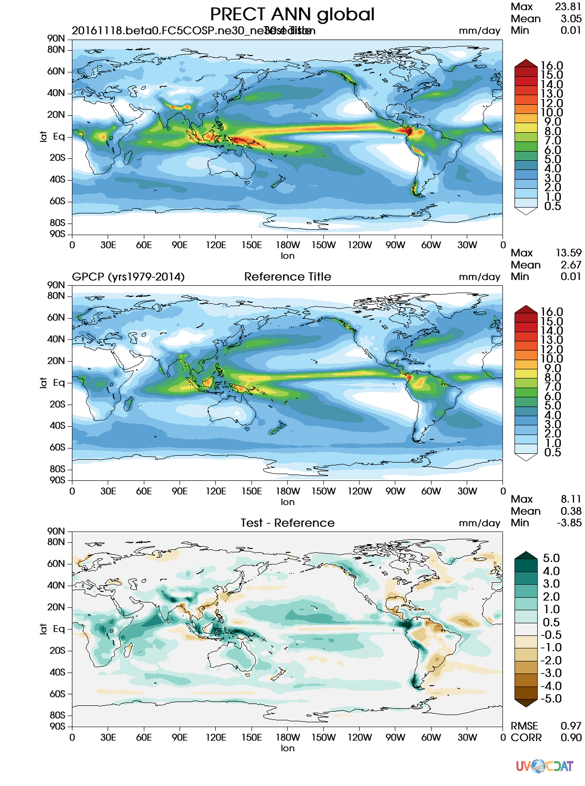

Available Parameters
====================

The driver needs a parameters file to run. In these files, there is
support for many features related to diagnostics.

Given a command like ``e3sm_diags -p params.py``, the
parameters in ``params.py`` will overwrite any predefined values for all
of the runs.

Parameters for diagnostics
~~~~~~~~~~~~~~~~~~~~~~~~~~

The parameters below are ones related to test/reference
specifications related to file I/O.

-  **run_type**: the supported run type for the diagnostics.  
   Possible options are: ``'model_vs_obs'`` (by default), ``'model_vs_model'``, or ``'obs_vs_obs'``.

-  **reference_data_path**: path to the reference (obs) data.
-  **test_data_path**: path to the test (model) data.
-  **test_name**: the name of the test (model output) file. It should be a string matches the model output name, for example ``'20161118.beta0.FC5COSP.ne30_ne30.edison'``.
-  **results_dir**: the name of the folder where all runs will be
   stored. If not defined, the folder where all of the results are
   created in is named ``e3sm_diags_results-<TIMESTAMP>``.
-  **case_id**: the name of the folder where the results (plots and
   nc files) will be stored for a single run. ex: ``results_dir/case_id``
-  **save_netcdf**: set to ``True`` if you want the reference, test,
   and difference data saved. It's ``False`` by default.

The parameters below are for running the diagnostics in parallel using
multiprocessing or distributedly.

-  **num_workers**: Used to define the number of processes to use with
   both ``multiprocessing`` and ``distributed``. If not defined, it
   is defaulted to ``4``. ex: ``num_workers = 8``
-  **multiprocessing**: set to ``True`` to use multiprocessing. It's
   ``False`` by default. ``multiprocessing`` and ``distributed`` cannot
   both be ``True.``
-  **distributed**: set to ``True`` to run the diagnostics
   distributedly. It's ``False`` by default. ``multiprocessing`` and
   ``distributed`` cannot both be ``True.`` A Dask cluster needs to be
   up and running. You'll probably never use this.

The parameters below are related to the actual climate-related
functionality of the diagnostics.

-  **sets**: A list of the sets to be run. All of the possible values are:
   ``sets=['zonal_mean_xy', 'zonal_mean_2d', 'lat_lon, 'polar', 'cosp_histogram']``
   or ``sets=['3', '4', '5, '7', '13']``. Used inconjunction with the ``run_type``
   parameter to ...
-  **variables**: What variable(s) to use for this run. Ex:
   ``variables=["T", "PRECT"]``.
-  **seasons**: A list of season to use. Possible values are:
   "ANN", "DJF", "MAM", "JJA", "SON". Ex:
   ``seasons=["ANN", "DJF", "MAM", "JJA", "SON"]``.
-  **regions**: A list of regions. If not defined, it's set to ``['global']`` by default.
   See `default_regions.py
   <https://github.com/E3SM-Project/acme_diags/blob/master/acme_diags/derivations/default_regions.py>`__
   for a list of possible regions. Ex: ``regions=["global","TROPICS"]``.
-  **plevs**: A list of pressure levels to use. Ex:
   ``plevs=[850.0, 200.0]``.
-  **regrid_tool**: The regrid tool to use.
   Set to ``'esmf'`` by default when no value is given.
-  **regrid_method**: What regird method of the regrid tool to use.
   Possible values are ``'linear'``, or ``'conservative'``. Set to
   ``'linear'`` by default when no value is given. Read the CDMS documentation for more information.
-  **debug**: If ``True``, stops running all of the diagnostics on the first failure.
   Is ``False`` by default, so all errors are caught and ignored. If there was an error and a plot could
   not be created, there's a '---' for that set of parameters in the viewer.

Parameters for plotting
~~~~~~~~~~~~~~~~~~~~~~~

The figure below is an sample output. We use this to described what each
plotting parameter does.

   An example plot created from the software

Below are general plotting-related parameters.

-  **main_title**: Main title of the image. It's ``"PRECT ANN global"`` in this example, which is automatically
   generate by E3SM Diagnostics. You can define ``main_title`` to change this.
-  **backend**: Can either be ``'vcs'`` or ``'cartopy'``/``'mpl'``/``'matplotlib'``.
-  **output_format**: A list of formats that yout want the plot to
   be output to. Can be something like ``['png', 'pdf', 'svg'].`` Is
   ``['png']`` when nothing is present.
-  **canvas_size_w [vcs]**: width of the image in pixels and only used by
   vcs. Is ``1212`` by default.
-  **canvas_size_h [vcs]**: height of the image in pixels and only used by
   vcs. Is ``1628`` by default.
-  **figsize [mpl]**: figure size (WxH, inches) for Matplolib figures. Default is ``[8.5, 11.0]``.
-  **dpi [mpl]**: figure resolution for Matplotlib. Default is ``150``.
-  **arrows**: Is either ``True`` (default value) or ``False`` and
   will accordingly show or hide the arrows on the legend for all of the
   graphs.
-  **logo**: ``True`` (default value) to show the UV-CDAT logo on
   the vcs backend, ``False`` to not. Just keep it on please.

The parameters below are for each of the three plots (``test``,
``reference``, and ``diff``) in the image.

-  **test_title**: the title for the test plot. It's ``"Test Title"`` in
   the image ((upper central texts above the test (model) figure) and is blank by default.
-  **test_colormap**: If not defined in the parameters, the default
   value is ``'cet_rainbow.rgb'``. It's ``'WhiteBlueGreenYellowRed.rgb'``
   in the image above. Matplotlib colormaps are supported.
   Users can even use colormaps located in `acme_diags/plot/colormaps 
   <https://github.com/E3SM-Project/acme_diags/tree/master/acme_diags/plot/colormaps>`_, 
   by referencing them by the filename
   (ex: ``'cet_rainbow.rgb'``). Also, paths to a custom ``.rgb`` file is
   supported.
-  **short_test_name**: an optional short name that users specify to be shown on the diagnostics figure.
   It's ``'beta0.FC5COSP.ne30'`` in the example figure.
   If not specified, the value in the ``test_name`` parameter will be shown.
-  **contour_levels**: the levels on the legend of the test and
   reference plot. It's ``[0.5, 1, 2, 3, 4, 5, 6, 7, 8, 9, 10, 12, 13, 14, 
   15, 16]`` in the image but automatically gets the range by default when not defined.
-  **test_units**: the units that are on the top-right of the test
   plot. It's ``"mm/day"`` in the image. If not defined, it automatically gets the
   units from the test data.

The ``reference`` and ``diff`` plots also have the same keywords which
are semantically the same for their respective plots. Below are the
values they hold for the image above.

-  **reference_name**: the name of the reference (obs) file to be printed on the plots (upper left texts above the reference (obs) figure). This doesn't need to be defined if your running ``model_vs_model``. In
   the built-in parameters files for these, the ``reference_name`` is
   already defined.
-  **reference_title**: ``"Reference Title"`` in the image (upper central texts above the reference (obs) figure) and is blank
   by default.
-  **reference_colormap**: If not defined in the parameters, the default
   value is ``'cet_rainbow.rgb'``. It's ``'WhiteBlueGreenYellowRed.rgb'``
   in the image above. Matplotlib colormaps
   are supported. Users can even use colormaps located in
   ``acme_diags/plot/colormaps/``, by referencing them by the filename
   (ex: ``'cet_rainbow.rgb'``). Also, paths to a custom ``.rgb`` file is
   supported.
-  **contour_levels**: You only need one ``contour_levels`` in you
   script. It's used in the reference plot. It's ``[0.5, 1, 2, 3, 4, 5, 6, 7,
   8, 9, 10, 12, 13, 14, 15, 16]`` in the image.
-  **reference_units**: ``"mm/day"`` in the image. If blank, it
   automatically gets the units from the reference data.

-  **diff_name**: optional text to be specified by the users to be printed upper left above the diff figure.
-  **diff_title**: ``"Test - Reference"`` in the image (upper central texts above the diff figure). If blank, the
   default is ``"Model - Observation"``.
-  **diff_colormap**: is ``'BrBG'`` in the image above and
   ``'diverging_bwr.rgb'`` by default. Matplotlib colormaps are supported. Users can
   even use colormaps located in ``acme_diags/plot/colormaps/``, by
   referencing them by the filename (ex: ``'cet_rainbow.rgb'``). Also,
   paths to a custom ``.rgb`` file is supported.
-  **diff_levels**: ``[-5, -4, -3, -2, -1, -0.5, 0.5, 1, 2, 3, 4, 5]``
   in the image but automatically gets the range by default.
-  **diff_units**: ``"mm/day"`` in the image. If blank, it automatically
   gets the units from the test - reference data.
